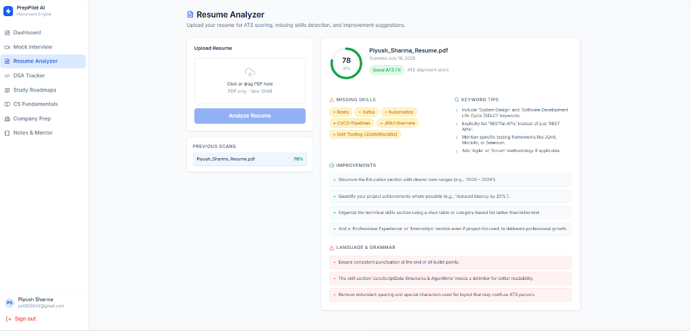
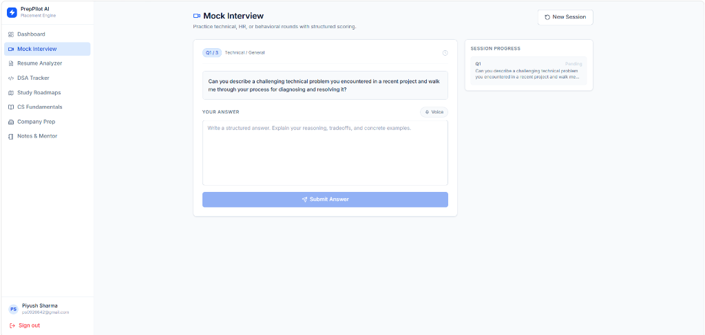

<div align="center">

# 🚀 PrepPilot AI

**The Ultimate AI-Powered Placement Preparation Platform for Software Engineers**

[](https://opensource.org/licenses/MIT)
[](https://nodejs.org/)
[](https://reactjs.org/)
[](https://www.mongodb.com/)
[](https://ai.google.dev/)
[](http://makeapullrequest.com)

</div>

---

## 📖 Overview

PrepPilot AI is a comprehensive, production-grade SaaS application designed to help software engineering students and professionals ace their placement interviews. By leveraging the power of Google's Gemini AI, PrepPilot provides real-time personalized resume analysis, dynamic mock interviews, custom-generated learning roadmaps, and DSA tracking.

Designed with a premium SaaS aesthetic inspired by Notion, Linear, and GitHub, the platform delivers a flawless, distraction-free user experience.

---

## ✨ Features

- **📄 AI Resume Analyzer**: Upload your resume (PDF) and receive an instant ATS score, missing skills detection, keyword optimization, and grammar suggestions.
- **🎙️ AI Mock Interviews**: Participate in dynamic Technical, HR, and Behavioral interviews. The AI evaluates your answers in real-time, providing constructive feedback and scoring.
- **🗺️ AI Roadmaps**: Generate customized week-by-week study plans tailored to specific target companies (e.g., Google, Amazon, Stripe) and your existing skill set.
- **📊 DSA & Progress Tracking**: Keep a log of your Data Structures & Algorithms practice with built-in heatmaps and streak counters.
- **🤖 AI Career Mentor**: Chat directly with an AI mentor for career advice, technical explanations, and interview tips.
- **🔐 Secure Authentication**: JWT-based authentication system with robust password hashing.

---

## 📸 Application Screenshots

| Dashboard | Mock Interview |
|-----------|----------------|
|  |  |

| Resume Analyzer | AI Roadmap |
|-----------------|------------|
|  |  |

---

## 🛠️ Technology Stack

**Frontend:**
- React 18 (Vite)
- Tailwind CSS v4
- Chart.js & React-ChartJS-2
- React Router DOM
- Lucide React (Icons)

**Backend:**
- Node.js & Express.js
- MongoDB & Mongoose
- `@google/genai` (Google Gemini AI SDK)
- JSON Web Tokens (JWT) & bcryptjs
- Multer & pdf-parse (File upload and text extraction)

---

## 📂 Folder Structure

The project is structured as a monorepo containing both the frontend and backend.

```text
preppilot-ai/
├── assets/                # Screenshots and documentation assets
├── backend/               # Node.js + Express API
│   ├── src/
│   │   ├── config/        # Database & Environment Loaders
│   │   ├── controllers/   # Route handlers
│   │   ├── middleware/    # Auth & File upload middlewares
│   │   ├── models/        # Mongoose Schemas
│   │   ├── routes/        # Express API routes
│   │   └── services/      # Gemini AI integration logic
│   ├── .env.example
│   └── package.json
├── docs/                  # Extensive Architecture & API Documentation
├── frontend/              # React + Vite Client
│   ├── src/
│   │   ├── components/    # Reusable UI components
│   │   ├── context/       # React Context (Auth)
│   │   ├── pages/         # Application Views (Dashboard, Login, etc.)
│   │   ├── services/      # Axios API client wrapper
│   │   └── index.css      # Tailwind v4 Configuration & Base Styles
│   ├── index.html
│   └── package.json
└── README.md
```

---

## 🏛️ Architecture

PrepPilot AI utilizes a decoupled MERN architecture with an AI micro-service integration layer. 
For an in-depth breakdown of the system design, request lifecycle, and AI flow, please see our [Architecture Documentation](./docs/Architecture.md).

---

## 🚀 Installation & Local Development

### 1. Prerequisites
- Node.js (v18+)
- MongoDB Atlas Account (or local MongoDB)
- Google Gemini API Key

### 2. Clone the Repository
```bash
git clone https://github.com/yourusername/preppilot-ai.git
cd preppilot-ai
```

### 3. Environment Variables
Navigate to the backend directory and copy the example environment file:
```bash
cd backend
cp .env.example .env
```
Fill in the values in `backend/.env`:
```env
PORT=5000
JWT_SECRET=your_super_secret_key
MONGODB_URI=mongodb+srv://<user>:<password>@cluster.mongodb.net/preppilot
GEMINI_API_KEY=your_gemini_api_key
```

### 4. Start the Backend
```bash
npm install
npm run dev
```

### 5. Start the Frontend
Open a new terminal window:
```bash
cd frontend
npm install
npm run dev
```

The application will now be running at `http://localhost:5173`.

---

## ☁️ Deployment

Deploying PrepPilot AI is straightforward:
- **Frontend**: Best hosted on **Vercel**.
- **Backend**: Best hosted on **Render** or **Railway**.
- **Database**: Hosted on **MongoDB Atlas**.

For step-by-step instructions, see our [Deployment Guide](./docs/Deployment.md).

---

## 🔌 API Overview

PrepPilot offers a robust REST API for authentication, resume analysis, interviewing, and DSA tracking. 
Detailed payloads, headers, and endpoints can be found in our [API Documentation](./docs/API.md).

---

## 🔮 Future Enhancements
- [ ] Add real-time speech-to-text for AI Mock Interviews using the Web Speech API.
- [ ] Integrate GitHub OAuth for 1-click registration.
- [ ] Support LeetCode API integration for automatic DSA progress fetching.
- [ ] Implement WebSockets for live AI Mentor streaming responses.

---

## 📄 License
This project is licensed under the [MIT License](LICENSE).

---

## 👨‍💻 Author
Built by **The PrepPilot AI Team**.

<div align="center">
  <br />
  <i>If you found this project helpful, please consider giving it a ⭐ on GitHub!</i>
</div>
