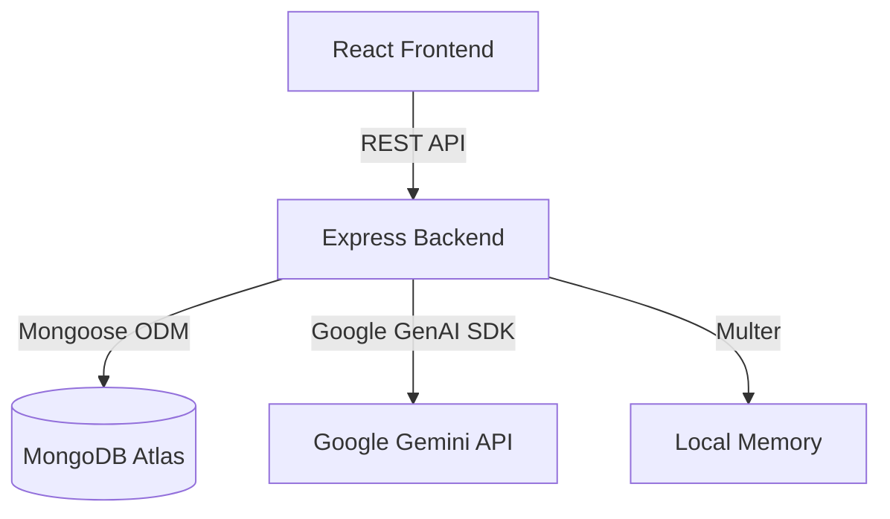
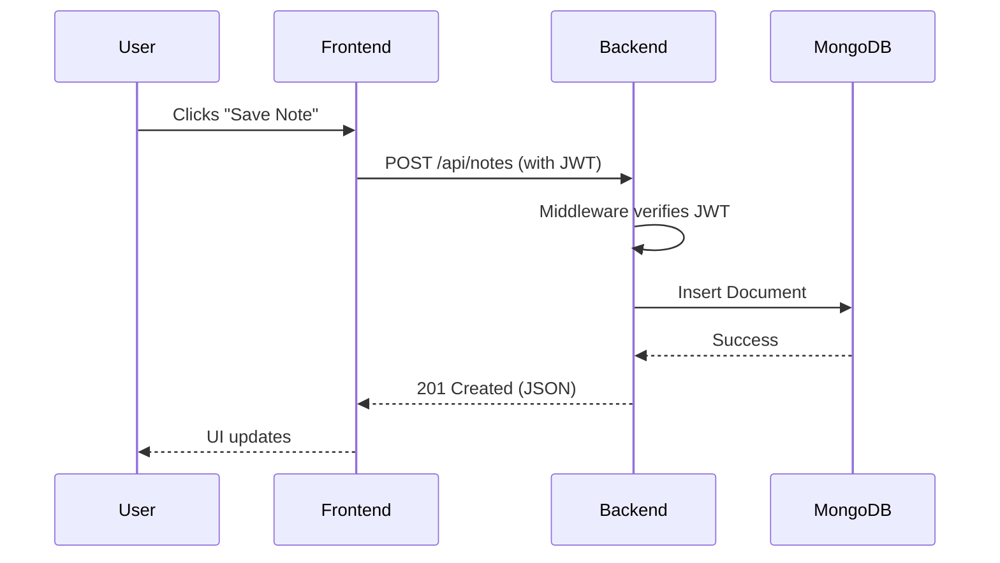

# 🏛️ Architecture & System Design

PrepPilot AI is built using the **MERN** stack (MongoDB, Express, React, Node.js) combined with modern AI integrations via the Google GenAI SDK. The architecture is designed to be highly modular, scalable, and secure, ensuring a robust foundation for enterprise-level deployment and future enhancements.

---

## 1. High-Level Architecture



### Key Components:
- **Client (Frontend)**: A Single Page Application (SPA) built with React 18 and Vite. Handles user interactions, UI rendering, and client-side routing securely.
- **API (Backend)**: A Node.js/Express server that acts as the central orchestrator. It verifies authentication, communicates with the database, and proxies requests to external AI providers.
- **Database (MongoDB)**: A NoSQL database hosting collections for Users, Resumes, Interviews, DSATracking, Roadmaps, and Notes.
- **AI Engine (Gemini)**: Provides the intelligence for the application, handling unstructured data (resumes) and generating dynamic content (interviews, roadmaps) via prompt engineering.

---

## 2. Request Flow



---

## 3. Authentication Flow

PrepPilot AI relies on a stateless JSON Web Token (JWT) architecture.
1. The user provides email and password credentials.
2. The `authController` hashes passwords using `bcryptjs` for registration, or compares hashes for login.
3. Upon success, a signed JWT is returned to the client.
4. The React frontend stores this token in standard web storage and automatically attaches it to the `Authorization` header via an Axios interceptor.
5. Backend `authMiddleware` intercepts incoming private requests, verifies the token signature, and attaches the decoded `user.id` to the request object.

---

## 4. AI Integration Flow

The backend handles all AI communication to prevent leaking API keys to the client.

### Resume Analysis Flow
1. **Upload**: User uploads a PDF to the frontend.
2. **Transfer**: Frontend sends a `multipart/form-data` request to the backend.
3. **Extraction**: `uploadMiddleware` handles the file in memory, and `pdf-parse` extracts raw text from the buffer.
4. **Prompt Engineering**: The `aiService` wraps the text in a highly specific system prompt enforcing a strict JSON return schema.
5. **Generation**: The `@google/genai` SDK sends the prompt to the Gemini API, requesting `responseMimeType: "application/json"`.
6. **Persistence**: The backend receives the JSON, validates it, and saves a new `Resume` document in MongoDB.
7. **Response**: The frontend receives the formatted data and renders the ATS score and improvements.

### Mock Interview Flow
1. **Initialization**: The user selects a category (e.g., React Technical). The backend requests an initial tailored question from the AI.
2. **Feedback Loop**: When the user submits an answer, the backend sends the question and the user's answer to the AI.
3. **Scoring**: The AI returns a structured JSON payload containing a score (0-100) and actionable feedback.
4. **Progression**: The AI then generates the *next* logical question based on the interview history.

---

## 5. Database Architecture

The data layer is managed via Mongoose schemas with strict typing and validation.

- **Users**: Central entity.
- **Resumes**: Tied to `Users` (1:N relationship).
- **Roadmaps**: Tied to `Users` (1:N relationship).
- **Interviews**: Tied to `Users` (1:N relationship). Contains an embedded array of Q&A history.
- **DSA Tracking**: Tied to `Users` (1:N relationship). Uses compound indexes on `user` and `date` to enforce one entry per day.

---

## 6. Folder Structure

```text
preppilot-ai/
├── backend/               
│   ├── src/
│   │   ├── config/        # DB Connection & Env Initialization
│   │   ├── controllers/   # Request/Response orchestration
│   │   ├── middleware/    # Auth, Error handling, Multer
│   │   ├── models/        # Mongoose Data Models
│   │   ├── routes/        # Express router definitions
│   │   └── services/      # AI API Wrappers
│   └── app.js             # Server entry point
└── frontend/              
    ├── src/
    │   ├── components/    # Reusable UI elements (Buttons, Inputs)
    │   ├── context/       # Global State (AuthContext)
    │   ├── pages/         # Full Views (Dashboard, Login)
    │   ├── services/      # Axios fetch wrappers
    │   ├── utils/         # Helper functions
    │   └── index.css      # Tailwind v4 configuration
    └── main.jsx           # React DOM Mount
```

---

## 7. Deployment Architecture

- **Frontend**: Deployed on CDN-backed serverless infrastructure (e.g., Vercel) for rapid asset delivery.
- **Backend**: Hosted on Node.js container environments (e.g., Render, Railway) to support long-polling and heavy in-memory PDF parsing.
- **Database**: Fully managed MongoDB Atlas cluster allowing for seamless scaling and automated backups.

---

## 8. Scalability Considerations

- **Stateless Authentication**: Because the app uses JWTs, the backend is entirely stateless. This allows horizontal scaling across multiple instances or serverless functions without sticky sessions.
- **Cloud Storage**: Currently, resume PDFs are parsed in memory. To scale, future iterations should upload PDFs directly to an S3 bucket via presigned URLs, returning a reference to the backend.
- **Caching**: AI requests are computationally expensive. Implementing a Redis cache layer for identical roadmap generations or static queries could significantly reduce API costs and latency.
- **Rate Limiting**: Implementation of API rate limiting per user IP to protect against abuse and control AI API costs.
